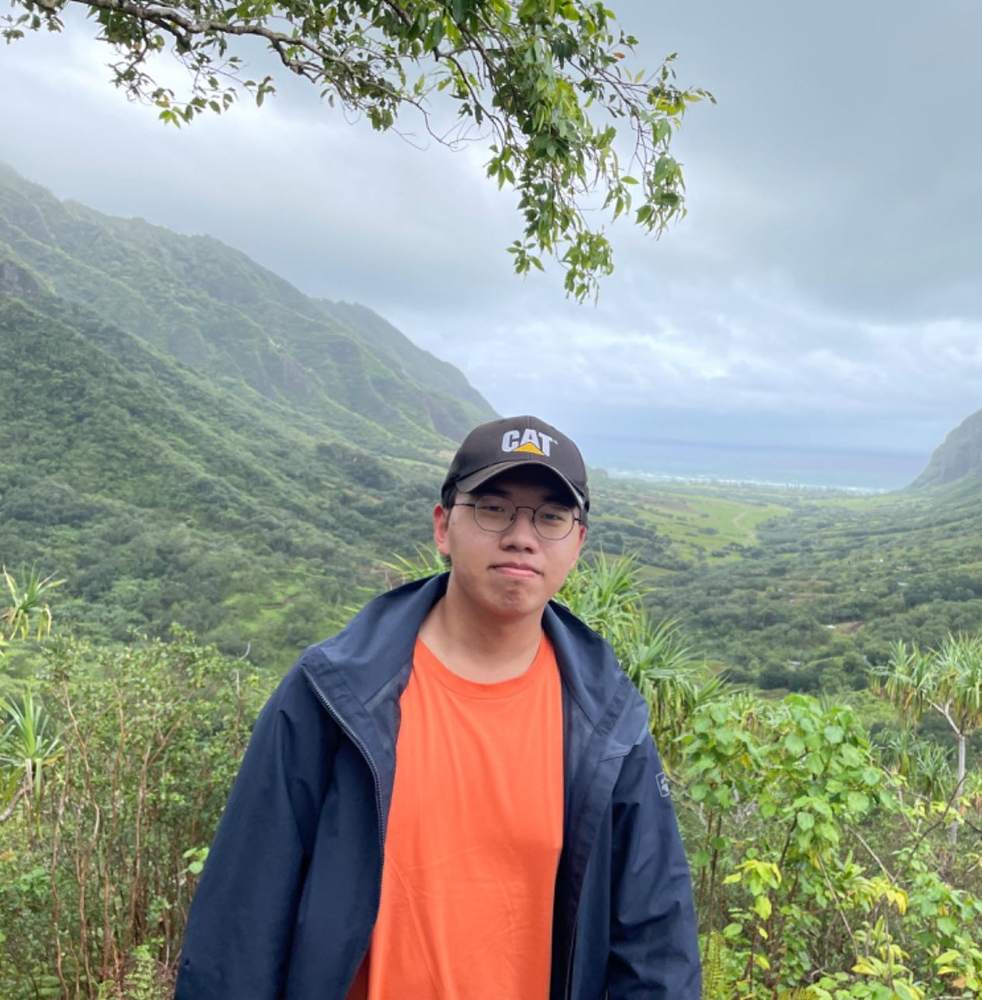

# About Me

Here is **Zihao Wei**.

I am a second year master student majoring in **Computer Science** at Universtiy of Michigan - Ann Arbor. Currently, I serve as a research assistant, advised by [Prof. Andrew Owens](https://andrewowens.com/). I previously worked with with [Prof. Cihang Xie](https://cihangxie.github.io/) and [Prof. Yuyin Zhou](https://yuyinzhou.github.io/) during the summer research at UCSC.

If you are interested in any aspect of me, I would love to chat and collaborate, please email me at - *zihaowei@umich.edu*

## Academic Background

**[Highlight] I am actively looking for PhD position to start in 2025 Fall. Contact me if you have any leads!**

- **Aug 2023 - Present:** University of Michigan (MS, Computer Science)
- **Aug 2021 - Apr 2023:** University of Michigan (BSE, Computer Science)
- **Sep 2019 - Aug 2023:** Shanghai Jiao Tong University (BSE, Electrical and Computer Engineering)

---

## Research Interests

- Representation Learning
- Multimodality Learning
- Generative Model
- Medical Image

My current research revolves finding optimal representations across diverse modalities, aiming to establish robust foundations for downstream tasks within the field of computer vision.

---

## News and Updates

- **Apr 2024：** One **first author** paper is accepted by the Efficient Deep Learning for Computer Vision Workshop 2024 at CVPR. 
- **Feb 2024：** Two **co-first author** papers is accepted by CVPR 2024.
- **Aug 2023：** One **first author** papers is accepted by PRICAI 2023.
- **Jun 2023：** One **co-first author** papers is accepted as **oral** by MICCAI 2023.

---
## Selected Papers
>_italics_ denotes equal contribution

- **Masked Autoencoders are Secretly Efficient Learners**
 **Zihao Wei**, Chen Wei, Jieru Mei, Yutong Bai, Zeyu Wang, Xianhang Li, Hongru Zhu, Huiyu Wang, Alan Yuille, Yuyin Zhou and Cihang Xie
  Efficient Deep Learning for Computer Vision Workshop 2024 at CVPR (CVPRW 2024 **oral**)

- **Efficient Vision-Language Pre-training by Cluster Masking**
 **_Zihao Wei_**, _Zixuan Pan_ and Andrew Owens
  Proceedings of the IEEE/CVF Conference on Computer Vision and Pattern Recognition 2024 (CVPR 2024)

- **MicroDiffusion: Implicit Representation-Guided Diffusion for 3D Reconstruction from Limited 2D Microscopy Projections**
  _Mude Hui_, **_Zihao Wei_**, Hongru Zhu, Fei Xia and Yuyin Zhou
  Proceedings of the IEEE/CVF Conference on Computer Vision and Pattern Recognition 2024 (CVPR 2024)

- **A-ESRGAN: Training Real-World Blind Super-Resolution with Attention U-Net Discriminators**
  **Zihao Wei**, Yidong Huang, Yuang Chen, Chenhao Zheng and Jingnan Gao
  Pacific Rim International Conference on Artificial Intelligence 2023: Trends in Artificial Intelligence (PRICAI 2023)

- **SwinMM: Masked Multi-view with Swin Transformers for 3D Medical Image Segmentation**
 _Yiqing Wang_, _Zihan Li_, _Jieru Mei_, **_Zihao Wei_**, Li Liu, Chen Wang, Shengtian Sang, Alan L. Yuille, Cihang Xie and Yuyin Zhou
  Medical Image Computing and Computer Assisted Intervention 2023 (MICCAI 2023 **oral**)

---
## Competitions
- May 2021：Third Prize in 11-th Innovation, Creativity and Entrepreneurship Comptetition
- Feb 2021：**Finalist Award** in Mathematical Contest In Modeling (Top 1%)
- Dec 2020：**The Excellence Awards** in World Robot Competition Finalsan and Smart Robot Expo (Top 1)
- Dec 2019：**Best Design Awards** in China trails for 2019 VEX World Companships

---
## Honors
- Aug 2023: Summa Cum Laude
- Apr 2023: Dean's List
- Dec 2022: University Honors
- Dec 2022: Dean's List
- Apr 2022: University Honors
- Apr 2022: Dean's List
- Dec 2021: University Honors
- Dec 2021: Dean's List
- Aug 2020: Academic Excellent Scholarship

---
## Services
- ICCV 2025 Reviewer
- CVPR 2025 Reviewer
- WACV 2025 Reviewer
- AAAI 2025 Reviewer
- ECCV 2024 Reviewer
- CVPR 2024 Reviewer
- ICCV 2023 Reviewer
- CVPR 2023 Reviewer
