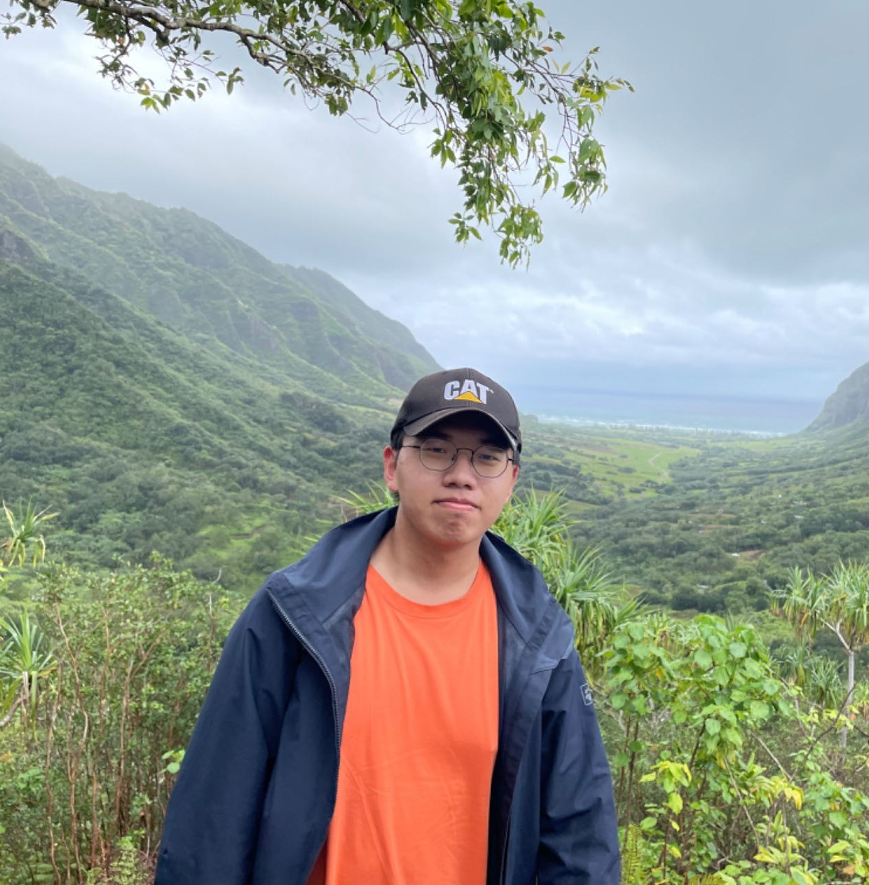

# About Me

Here is **Zihao Wei**.

I am a first-year Ph.D. student in Computer Science at the University of Maryland, College Park, where I work as a research assistant under the supervision of [Prof. Ruohan Gao](https://ruohangao.github.io/). Prior to this, I completed my master’s studies under the guidance of [Prof. Andrew Owens](https://andrewowens.com/) at University of Michigan, Ann Arbor. I have also had the opportunity to collaborate with [Prof. Cihang Xie](https://cihangxie.github.io/), [Prof. Yuyin Zhou](https://yuyinzhou.github.io/), and [Prof. Alan Yuille](https://www.cs.jhu.edu/~ayuille1/) during a summer research internship at Johns Hopkins University and the University of California, Santa Cruz. During my undergraduate studies, I worked with [Prof. Chengbin Ma](https://sites.google.com/view/chbma17/home) at Shanghai Jiao Tong University.

If you are interested in learning more about me, I would love to chat and explore potential collaboration opportunities. Please email me at - *zihaowei@umd.edu*

## Academic Background
- **Sep 2025 - Present:** University of Maryland, College Park (Ph.D, Computer Science)
- **Aug 2023 - Apr 2025:** University of Michigan (MS, Computer Science)
- **May 2022 - Oct 2023:** University of California, Santa Cruz (Research Intern)
- **Summer 2022:** Johns Hopkins University (Research Intern)
- **Aug 2021 - Apr 2023:** University of Michigan (BSE, Computer Science)
- **Sep 2019 - Aug 2023:** Shanghai Jiao Tong University (BSE, Electrical and Computer Engineering)

---

## Research Interests

- Self-supervised Representation Learning
- Multimodality Learning

---

## News and Updates
- **Apr 2026：**  Join JSALT workshop at JHU.
- **Aug 2025：** One paper is accepted by EMNLP 2025.
- **Mar 2025：** Will join UMD as a PhD student.
- **Apr 2024：** One **first author** paper is accepted by the Efficient Deep Learning for Computer Vision Workshop 2024 at CVPR. 
- **Feb 2024：** Two **co-first author** papers is accepted by CVPR 2024.
- **Aug 2023：** One **first author** papers is accepted by PRICAI 2023.
- **Jun 2023：** One **co-first author** papers is accepted as **oral** by MICCAI 2023.

---
## Selected Papers
>_italics_ denotes equal contribution

- **Masked Diffusion Captioning for Visual Feature Learning**
 Chao Feng, **Zihao Wei** and Andrew Owens
  Proceedings of the 2025 Conference on Empirical Methods in Natural Language Processing  (EMNLP 2025 Findings)

- **Masked Autoencoders are Secretly Efficient Learners**
 **Zihao Wei**, Chen Wei, Jieru Mei, Yutong Bai, Zeyu Wang, Xianhang Li, Hongru Zhu, Huiyu Wang, Alan Yuille, Yuyin Zhou and Cihang Xie
  Efficient Deep Learning for Computer Vision Workshop 2024 at CVPR (CVPRW 2024 **oral**)

- **Efficient Vision-Language Pre-training by Cluster Masking**
 **_Zihao Wei_**, _Zixuan Pan_ and Andrew Owens
  Proceedings of the IEEE/CVF Conference on Computer Vision and Pattern Recognition 2024 (CVPR 2024)

- **MicroDiffusion: Implicit Representation-Guided Diffusion for 3D Reconstruction from Limited 2D Microscopy Projections**
  _Mude Hui_, **_Zihao Wei_**, Hongru Zhu, Fei Xia and Yuyin Zhou
  Proceedings of the IEEE/CVF Conference on Computer Vision and Pattern Recognition 2024 (CVPR 2024)

- **A-ESRGAN: Training Real-World Blind Super-Resolution with Attention U-Net Discriminators**
  **Zihao Wei**, Yidong Huang, Yuang Chen, Chenhao Zheng and Jingnan Gao
  Pacific Rim International Conference on Artificial Intelligence 2023: Trends in Artificial Intelligence (PRICAI 2023)

- **SwinMM: Masked Multi-view with Swin Transformers for 3D Medical Image Segmentation**
 _Yiqing Wang_, _Zihan Li_, _Jieru Mei_, **_Zihao Wei_**, Li Liu, Chen Wang, Shengtian Sang, Alan L. Yuille, Cihang Xie and Yuyin Zhou
  Medical Image Computing and Computer Assisted Intervention 2023 (MICCAI 2023 **oral**)

---
## Competitions
- May 2021：Third Prize in 11-th Innovation, Creativity and Entrepreneurship Comptetition
- Feb 2021：**Finalist Award** in Mathematical Contest In Modeling (Top 1%)
- Dec 2020：**The Excellence Awards** in World Robot Competition Finalsan and Smart Robot Expo (Top 1)
- Dec 2019：**Best Design Awards** in China trails for 2019 VEX World Companships

---
## Honors
- Aug 2023: Summa Cum Laude
- Apr 2023: Dean's List
- Dec 2022: University Honors
- Dec 2022: Dean's List
- Apr 2022: University Honors
- Apr 2022: Dean's List
- Dec 2021: University Honors
- Dec 2021: Dean's List
- Aug 2020: Academic Excellent Scholarship

---
## Services
- AAAI Reviewer (2025, 2026)  
- NeurIPS Reviewer (2025)
- ICLR Reviewer (2026)
- ICCV Reviewer (2023, 2025)  
- CVPR Reviewer (2023, 2024, 2025, 2026)  
- WACV Reviewer (2025)  
- ECCV Reviewer (2024, 2026)

## Teaching
- CMSC 848M: Multimodal Computer Vision, Spring 2026
- CMSC 498K: Introduction to Multimodal Deep Learning, Fall 2025
- EECS 376: Foundations of Computer Science, Winter 2022
